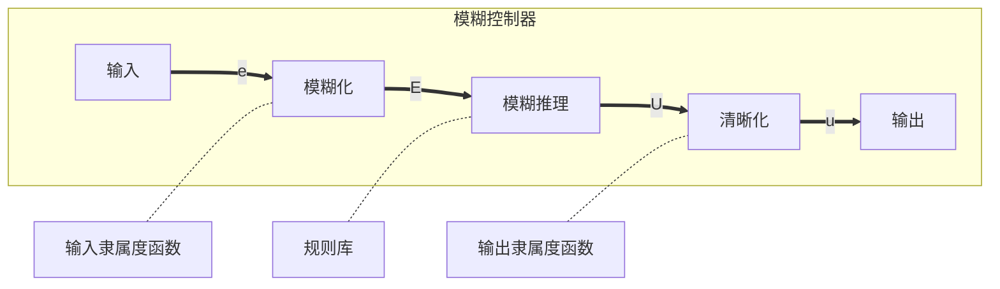

一般的控制器只有一套参数，无法实时调整，于是引入模糊控制器，对控制器的参数进行控制

模糊控制一般分为三个部分

1. 模糊化
2. 模糊推理
3. 去模糊化

# 模糊化

## 基本概念

- 模糊量：输入模糊控制器的量，如$E$（偏差）、$E_c (\frac{\mathrm dE}{\mathrm dt})$
- 论域：模糊子集上下限的区间
- 隶属度：隶属于某模糊子集的程度
- 模糊子集：
	- NB (Negetive Big)
	- NM (Negative Medium)
	- NS (Negative Small)
	- ZO (Zero)
	- PS (Positive Small)
	- PM (Positive Medium)
	- PB (Positive Big)

## 模糊化

根据隶属度函数（模糊函数）求隶属度。一般使用线性隶属度函数（三角隶属度函数）。例如对于一个测量信号$V$，其模糊化的过程如下：

1. 定义模糊子集$\{-3，-2，-1，0，1，2，3\}$，分别对应NB，NM，NS，ZO，PS，PM，PB
2. 将输入量化。为了将$E$和$E_c$与模糊子集对应，引入量化函数，$E$的范围为$V_{min}-V_{max} \sim V_{max}-V_{min}$，$E_c$为两次$E$作差，范围为$E$的二倍。采取线性量化，函数关系为$$f(E)=\frac{3*E}{V_{max}-V_{min}} \qquad f(E_c)=\frac{3*E_c}{2(V_{max}-V_{min})}$$例如$V_{max}=100,V_{min}=20,E=50,E_c=-120$，则$f(E)=1.875,f(E_c)=-2.25$
3. 计算隶属度。对于线性隶属度函数，我们只需计算量化值其与其所属的两个隶属度的差值比例即可。其中，$E$隶属于PS和PM，$E_c$隶属于NB和NM。$E$隶属于PS的隶属度为：$$\frac{1.875-1}{2-1}=\frac{7}{8}$$$E$隶属于PM的隶属度为：$$\frac{2-1.875}{2-1}=\frac{1}{8}$$$E_c$隶属于NB的隶属度为：$$\frac{-2.25-(-3)}{-2-(-3)}=\frac{3}{4}$$$E_c$隶属于NM的隶属度为：$$\frac{-2-(-2.25))}{-2-(-3)}=\frac{1}{4}$$可以看出，对于一个输入$E$，它所属的两个隶属度的和为1

## 模糊推理

模糊推理：根据模糊规则表求输出值U的隶属度，决策出模糊输出量

对于一般的控制，我们可以制订以下模糊表规则：

| ___U___  | ___NB___ | ___NM___ | ___NS___ | ___ZO___ | ___PS___ | ___PM___ | ___PB___ |
| -------- | -------- | -------- | -------- | -------- | -------- | -------- | -------- |
| ___NB___ | PB       | PB       | PB       | PB       | PM       | ZO       | ZO       |
| ___NM___ | PB       | PB       | PB       | PM       | PM       | ZO       | ZO       |
| ___NS___ | PB       | PM       | PM       | PS       | ZO       | NS       | NM       |
| ___ZO___ | PM       | PM       | PS       | ZO       | NS       | NM       | NM       |
| ___PS___ | PS       | PS       | ZO       | NM       | NM       | NM       | NB       |
| ___PM___ | ZO       | ZO       | ZO       | NM       | NB       | NB       | NB       |
| ___PB___ | ZO       | NS       | NB       | NB       | NB       | NB       | NB       |

其中，第一列为$E$的取值，第一行为$E_c$的取值。

根据以上规则，可以求得输出值$U$隶属于各个模糊子集的隶属度为：
隶属于PS的隶属度为：$$U_{PS}=\frac{7}{8}*\frac{3}{4}+\frac{7}{8}*\frac{1}{4}=\frac{7}{8}$$隶属于ZO的隶属度为：$$U_{ZO}=\frac{1}{8}*\frac{3}{4}+\frac{1}{8}*\frac{1}{4}=\frac{1}{8}$$

| ___U___      | ==___NB___== | ==___NM___== | ___NS___ | ___ZO___ | ___PS___ | ___PM___ | ___PB___ |
| ------------ | ------------ | ------------ | -------- | -------- | -------- | -------- | -------- |
| ___NB___     | PB           | PB           | PB       | PB       | PM       | ZO       | ZO       |
| ___NM___     | PB           | PB           | PB       | PM       | PM       | ZO       | ZO       |
| ___NS___     | PB           | PM           | PM       | PS       | ZO       | NS       | NM       |
| ___ZO___     | PM           | PM           | PS       | ZO       | NS       | NM       | NM       |
| ==___PS___== | ==PS==       | ==PS==       | ZO       | NM       | NM       | NM       | NB       |
| ==___PM___==     | ==ZO==       | ==ZO==       | ZO       | NM       | NB       | NB       | NB       |
| ___PB___     | ZO           | NS           | NB       | NB       | NB       | NB       | NB       |

## 去模糊化

对于输出值，我们同样采用给予隶属度的方法。由于采用了相同的论域，模糊变量的隶属度是相同的。基于这一基础，采用重心法计算量化值。其公式如下：$$u_{out}=\frac{\sum_{i=0}^{n}U_i*F_i}{\sum_{i=0}^{n}U_i} \qquad U为隶属度，F为模糊子集的值$$对于三角隶属度函数，有：$$u_{out}=\sum_{i=0}^{n}U_i*F_i$$
对于上例，输出值为：$$u_{out}=0*\frac{1}{8}+1*\frac{7}{8}=0.75$$
是一个在论域范围内的量化值

要将其转化为实际值，使用以下公式：$$K(n)=K(n-1)+\partial*u_{out} \qquad \partial为增益参数$$
