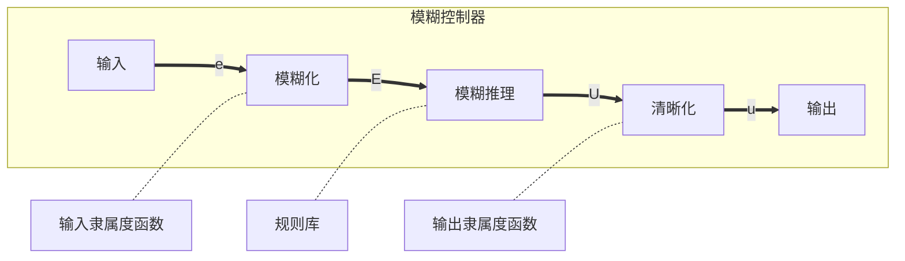

一般的控制器只有一套参数，无法实时调整，于是引入模糊控制器，对控制器的参数进行调整

模糊控制一般分为三个部分

1. 模糊化
2. 模糊推理
3. 去模糊化



# 模糊化

## 基本概念

- 模糊量：输入模糊控制器的量，如$E$（偏差）、$E_c (\frac{\mathrm dE}{\mathrm dt})$
- 论域：模糊子集上下限的区间
- 隶属度：隶属于某模糊子集的程度
- 模糊子集：
	- NB (Negetive Big)
	- NM (Negative Medium)
	- NS (Negative Small)
	- ZO (Zero)
	- PS (Positive Small)
	- PM (Positive Medium)
	- PB (Positive Big)

## 模糊化

根据隶属度函数（模糊函数）求隶属度。一般使用线性隶属度函数（三角隶属度函数）。例如对于一个测量信号$V$，其模糊化的过程如下：

1. 定义模糊子集$\{-3，-2，-1，0，1，2，3\}$，分别对应NB，NM，NS，ZO，PS，PM，PB
2. 将输入量化。为了将$E$和$E_c$与模糊子集对应，引入量化函数，$E$的范围为$V_{min}-V_{max} \sim V_{max}-V_{min}$，$E_c$为两次$E$作差，范围为$E$的二倍。采取线性量化，函数关系为$$f(E)=\frac{3E}{V_{max}-V_{min}} \qquad f(E_c)=\frac{3E_c}{2(V_{max}-V_{min})}$$例如$V_{max}=100,V_{min}=20,E=50,E_c=-120$，则$f(E)=1.875,f(E_c)=-2.25$
3. 计算隶属度。对于线性隶属度函数，我们只需计算量化值其与其所属的两个隶属度的差值比例即可。其中，$E$隶属于PS和PM，$E_c$隶属于NB和NM。$E$隶属于PS的隶属度为：$$\frac{1.875-1}{2-1}=\frac{7}{8}$$$E$隶属于PM的隶属度为：$$\frac{2-1.875}{2-1}=\frac{1}{8}$$$E_c$隶属于NB的隶属度为：$$\frac{-2.25-(-3)}{-2-(-3)}=\frac{3}{4}$$$E_c$隶属于NM的隶属度为：$$\frac{-2-(-2.25))}{-2-(-3)}=\frac{1}{4}$$可以看出，对于一个输入$E$，它所属的两个隶属度的和为1

## 模糊推理

模糊推理：根据模糊规则表求输出值U的隶属度，决策出模糊输出量

对于一般的控制，我们可以制订以下模糊表规则：

| ___U___  | ___NB___ | ___NM___ | ___NS___ | ___ZO___ | ___PS___ | ___PM___ | ___PB___ |
| -------- | -------- | -------- | -------- | -------- | -------- | -------- | -------- |
| ___NB___ | PB       | PB       | PB       | PB       | PM       | ZO       | ZO       |
| ___NM___ | PB       | PB       | PB       | PM       | PM       | ZO       | ZO       |
| ___NS___ | PB       | PM       | PM       | PS       | ZO       | NS       | NM       |
| ___ZO___ | PM       | PM       | PS       | ZO       | NS       | NM       | NM       |
| ___PS___ | PS       | PS       | ZO       | NM       | NM       | NM       | NB       |
| ___PM___ | ZO       | ZO       | ZO       | NM       | NB       | NB       | NB       |
| ___PB___ | ZO       | NS       | NB       | NB       | NB       | NB       | NB       |

其中，第一列为$E$的取值，第一行为$E_c$的取值。

根据以上规则，可以求得输出值$U$隶属于各个模糊子集的隶属度为：
隶属于PS的隶属度为：$$U_{PS}=\frac{7}{8}\cdot\frac{3}{4}+\frac{7}{8}\cdot\frac{1}{4}=\frac{7}{8}$$隶属于ZO的隶属度为：$$U_{ZO}=\frac{1}{8}\cdot\frac{3}{4}+\frac{1}{8}\cdot\frac{1}{4}=\frac{1}{8}$$

| ___U___      | ==___NB___== | ==___NM___== | ___NS___ | ___ZO___ | ___PS___ | ___PM___ | ___PB___ |
| ------------ | ------------ | ------------ | -------- | -------- | -------- | -------- | -------- |
| ___NB___     | PB           | PB           | PB       | PB       | PM       | ZO       | ZO       |
| ___NM___     | PB           | PB           | PB       | PM       | PM       | ZO       | ZO       |
| ___NS___     | PB           | PM           | PM       | PS       | ZO       | NS       | NM       |
| ___ZO___     | PM           | PM           | PS       | ZO       | NS       | NM       | NM       |
| ==___PS___== | ==PS==       | ==PS==       | ZO       | NM       | NM       | NM       | NB       |
| ==___PM___==     | ==ZO==       | ==ZO==       | ZO       | NM       | NB       | NB       | NB       |
| ___PB___     | ZO           | NS           | NB       | NB       | NB       | NB       | NB       |

## 去模糊化

对于输出值，我们同样采用给予隶属度的方法。由于采用了相同的论域，模糊变量的隶属度是相同的。基于这一基础，采用重心法计算量化值。其公式如下：$$u_{out}=\frac{\sum_{i=0}^{n}U_i \cdot F_i}{\sum_{i=0}^{n}U_i} \qquad U为隶属度，F为模糊子集的值$$对于三角隶属度函数，有：$$u_{out}=\sum_{i=0}^{n}U_i\cdot F_i$$
对于上例，输出值为：$$u_{out}=0 \cdot \frac{1}{8}+1 \cdot \frac{7}{8}=0.75$$
是一个在论域范围内的量化值

要将其转化为实际值，使用以下公式：$$K(n)=K(n-1)+\partial \cdot u_{out} \qquad \partial为增益参数$$

# 代码实现
## fuzzy_pid.c

```C
/**
 * @file    fuzzy_pid.h
 * @brief   模糊PID控制器
 * @version 1.0
 * @author  SkylerLiang
 * @date    2023-10-15
 * @note    仅测试使用
 */

#ifndef __FUZZY_PID_H
#define __FUZZY_PID_H

#include "GM6020.h"

// 模糊子集枚举
enum Union
{
    NB = -3,
    NM = -2,
    NS = -1,
    ZO = 0,
    PS = 1,
    PM = 2,
    PB = 3
};

// 将对应的PID控制结构体typedef为PIDController
// @note: 有些结构体的上次偏差命名为Err_Last，有些命名为Err_last，注意区分
typedef GM6020_PID PIDController;

// 隶属度结构体
typedef struct
{
    enum Union L_Union; /* 左侧隶属子集 */
    enum Union R_Union; /* 右侧隶属子集 */
    float L_Membership; /* 左侧隶属度 */
    float R_Membership; /* 右侧隶属度 */
} Membership;

// 模糊控制器结构体
typedef struct
{
    float MAX;                /* 实际最大值 */
    float MIN;                /* 实际最小值 */
    float E;                  /* 偏差（量化后） */
    float EC;                 /* 偏差变化（量化后） */
    float Kp_Output;          /* Kp增量 */
    float Ki_Output;          /* Ki增量 */
    float Kd_Output;          /* Kd增量 */
    Membership E_Membership;  /* E的隶属结构体 */
    Membership EC_Membership; /* EC的隶属结构体 */
} FuzzyController;

void LinearQuantization(FuzzyController *fc, float e, float ec);
void CalcMembership(Membership *ms, float qv);
void FuzzyComputation(FuzzyController *fc, float rule[7][7], float *output);
void FuzzyPID(PIDController *pidController);

#endif
```

## fuzzy_pid.c

```C
/**
 * @file    fuzzy_pid.c
 * @brief   模糊PID控制器
 * @version 1.0
 * @author  SkylerLiang
 * @date    2023-10-15
 * @note    仅测试使用
 */

#include "fuzzy_pid.h"

// 规则库，行为e，列为ec
float ruleKp[7][7] =
    {
        PB, PB, PM, PM, PS, PS, ZO,
        PB, PB, PM, PM, PS, ZO, ZO,
        PM, PM, PM, PS, ZO, NS, NM,
        PM, PS, PS, ZO, NS, NM, NM,
        PS, PS, ZO, NS, NS, NM, NM,
        ZO, ZO, NS, NM, NM, NM, NB,
        ZO, NS, NS, NM, NM, NB, NB};

float ruleKi[7][7] =
    {
        NB, NB, NB, NM, NM, ZO, ZO,
        NB, NB, NM, NM, NS, ZO, ZO,
        NM, NM, NS, NS, ZO, PS, PS,
        NM, NS, NS, ZO, PS, PS, PM,
        NS, NS, ZO, PS, PS, PM, PM,
        ZO, ZO, PS, PM, PM, PB, PB,
        ZO, ZO, PS, PM, PB, PB, PB};

float ruleKd[7][7] =
    {
        PS, PS, ZO, ZO, ZO, PB, PB,
        NS, NS, NS, NS, ZO, NS, PM,
        NB, NB, NM, NS, ZO, PS, PM,
        NB, NM, NM, NS, ZO, PS, PM,
        NB, NM, NS, NS, ZO, PS, PS,
        NM, NS, NS, NS, ZO, PS, PS,
        PS, ZO, ZO, ZO, ZO, PB, PB};

// 模糊控制器输出增益
double increase[3] = {0.1, 0.1, 0.1};

// 实例化模糊控制器，这里取值范围为GM6020电机允许的速度范围
FuzzyController fuzzyController = {
    .MAX = 320,
    .MIN = -320};

/**
 * @brief 将实际的偏差和偏差变化线性量化到论域[-3,3]范围内
 * @param fc 要被储存量化结果的模糊控制器
 * @param e 要被量化的偏差值
 * @param ec 要被量化的偏差变化值
 * @note  库内部调用
 */
void LinearQuantization(FuzzyController *fc, float e, float ec)
{
    fc->E = 3.0 * e / (fc->MAX - fc->MIN);
    fc->EC = 1.5 * ec / (fc->MAX - fc->MIN);
}

/**
 * @brief    根据线性隶属度函数计算给定输入值的隶属关系及隶属度
 * @param ms Membership，隶属度结构体，用于储存计算结果
 * @param qv Quantizated Value，量化后的输入值
 * @note     库内部调用
 */
void CalcMembership(Membership *ms, float qv)
{
    if (qv < NB)
    {
        ms->L_Union = NB;
        ms->R_Union = NB;
        ms->L_Membership = 0;
        ms->R_Membership = 1.0;
    }
    else if ((qv >= NB) && (qv < NM))
    {
        ms->L_Union = NB;
        ms->R_Union = NM;
        ms->L_Membership = -qv - 2.0;
        ms->R_Membership = qv + 3.0;
    }
    else if ((qv >= NM) && (qv < NS))
    {
        ms->L_Union = NM;
        ms->R_Union = NS;
        ms->L_Membership = -qv - 1.0;
        ms->R_Membership = qv + 2.0;
    }
    else if ((qv >= NS) && (qv < ZO))
    {
        ms->L_Union = NS;
        ms->R_Union = ZO;
        ms->L_Membership = -qv;
        ms->R_Membership = qv + 1.0;
    }
    else if ((qv >= ZO) && (qv < PS))
    {
        ms->L_Union = ZO;
        ms->R_Union = PS;
        ms->L_Membership = -qv + 1.0;
        ms->R_Membership = qv;
    }
    else if ((qv >= PS) && (qv < PM))
    {
        ms->L_Union = PS;
        ms->R_Union = PM;
        ms->L_Membership = -qv + 2.0;
        ms->R_Membership = qv - 1.0;
    }
    else if ((qv >= PM) && (qv <= PB))
    {
        ms->L_Union = PM;
        ms->R_Union = PB;
        ms->L_Membership = -qv + 3.0;
        ms->R_Membership = qv - 2.0;
    }
    else if (qv > PB)
    {
        ms->L_Union = PB;
        ms->R_Union = PB;
        ms->L_Membership = 1.0;
        ms->R_Membership = 0;
    }
}

/**
 * @brief        根据给定的规则和输入成员计算模糊控制器的输出
 * @param fc     包含输入成员信息的FuzzyController结构体
 * @param rule   用于模糊推理的7x7规则矩阵
 * @param output 指向将要计算的输出变量的指针
 * @note         库内部调用
 */
void FuzzyComputation(FuzzyController *fc, float rule[7][7], float *output)
{
    // 计算每条规则的输出，储存在临时数组中
    float temp[4];
    temp[0] = rule[fc->E_Membership.L_Union + 3][fc->EC_Membership.L_Union + 3] * (fc->E_Membership.L_Membership) * (fc->EC_Membership.L_Membership);
    temp[1] = rule[fc->E_Membership.L_Union + 3][fc->EC_Membership.R_Union + 3] * (fc->E_Membership.L_Membership) * (fc->EC_Membership.R_Membership);
    temp[2] = rule[fc->E_Membership.R_Union + 3][fc->EC_Membership.L_Union + 3] * (fc->E_Membership.R_Membership) * (fc->EC_Membership.L_Membership);
    temp[3] = rule[fc->E_Membership.R_Union + 3][fc->EC_Membership.R_Union + 3] * (fc->E_Membership.R_Membership) * (fc->EC_Membership.R_Membership);

    // 将计算结果求和，得到最终输出
    *output = (temp[0] + temp[1] + temp[2] + temp[3]);
}

/**
 * @brief               模糊PID控制器
 * @param pidController 指向PIDController结构体的指针，该结构体包含误差值和上次误差值。
 * @note                该函数应在PID控制器的计算周期内被调用，如GM6020_Set_Speed()函数中
 * @exception           有些结构体的上次偏差命名为Err_last，如报错请自行修改
 */
void FuzzyPID(PIDController *pidController)
{
    // 线性量化
    LinearQuantization(&fuzzyController, pidController->Err, pidController->Err - pidController->Err_Last);

    // 计算隶属度
    CalcMembership(&fuzzyController.E_Membership, fuzzyController.E);
    CalcMembership(&fuzzyController.EC_Membership, fuzzyController.EC);

    // Kp模糊推理
    FuzzyComputation(&fuzzyController, ruleKp, &fuzzyController.Kp_Output);
    pidController->Kp += fuzzyController.Kp_Output * increase[0];
    if (pidController->Kp < 0)
        pidController->Kp = 0;

    // Ki模糊推理
    FuzzyComputation(&fuzzyController, ruleKi, &fuzzyController.Ki_Output);
    pidController->Ki += fuzzyController.Ki_Output * increase[1];
    if (pidController->Ki < 0)
        pidController->Ki = 0;

    // Kd模糊推理
    FuzzyComputation(&fuzzyController, ruleKd, &fuzzyController.Kd_Output);
    pidController->Kd += fuzzyController.Kd_Output * increase[2];
    if (pidController->Kd < 0)
        pidController->Kd = 0;
}

```

Author：梁书恺
Date：2023/10/10